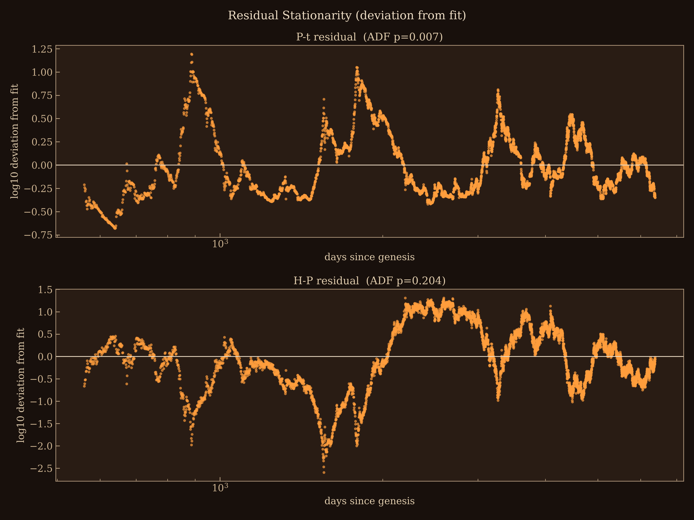
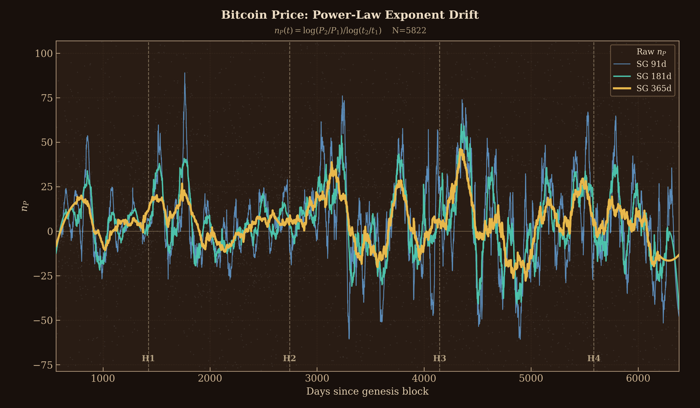
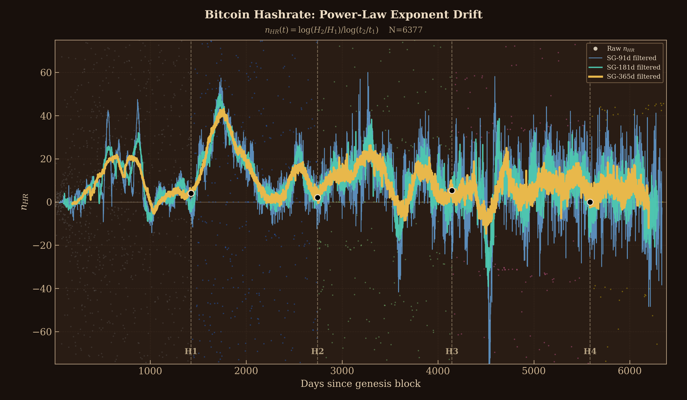
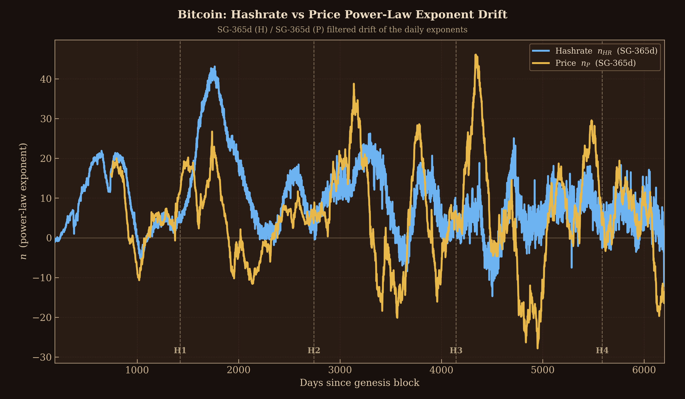
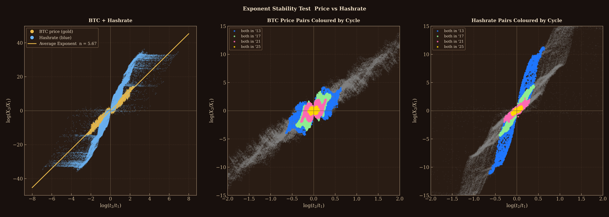
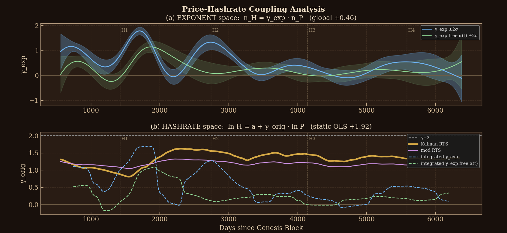

# PL-Cor — Bitcoin Power-Law Correlation
# Collab-work w/ A. Pecere (@ZeitgeistExplo1 on X), reg. Kaman RTS in price space

Tools for studying Bitcoin's **power-law scaling laws** and the coupling between
them — in particular the price exponent `n_P(t)` and the hashrate exponent
`n_HR(t)`. It treats Bitcoin as a coupled dynamical system.

Each metric `X` (price, hashrate, …) grows roughly as a power law of network
age `t` (days since the genesis block):

```
X(t) ≈ A · t^n
```

The **local exponent**, computed between consecutive days (natural log), is the
central quantity:

```
n(t) = log( X(t+1) / X(t) ) / log( t(t+1) / t(t) )
```

Working in this *exponent space* (rather than the price/level space) matters
because regressing two trending level series directly can give spurious results;
the residual stationarity test in `stationarity.py` checks whether a given level
relation is genuine or spurious.

## Math explainer draft

### `impulse-response-DRAFT.pdf`
Impulse-response (convolution) model between the hashrate and price exponents
`n_HR(t)` / `n_P(t)`: a Tikhonov-smoothed lag-kernel estimator with a
closed-form solution, cross-validation in time blocks, and
block-wild-bootstrap bands. Main result: the price->hashrate response is
permanent (step response `H(200) ~ +0.27..+0.33`, probe-invariant), whereas
hashrate->price is transient with a negative tail. Includes robustness checks
(probe grid, bear-regime interaction, L2 spring control, phase analysis) and
the mathematical background. (Draft, English.)

## Quick start

```
git clone https://github.com/dooomkopf/PL-Cor.git
cd PL-Cor
pip install -r requirements.txt   # Python dependencies only
python fetch_coinmetrics.py       # download cm_data.csv (CoinMetrics Community API)
python stationarity.py            # run any analysis (see the table below)
```

`pip install -r requirements.txt` installs only the Python packages — you still
clone the files and fetch the data (one `fetch_coinmetrics.py` run) yourself.

## Repository layout (convention)

Flat layout. One self-contained script per analysis:

```
name.py            # an executable analysis (run it directly)
name_README.txt    # what it does, the math, usage and options
```

Shared modules (imported by several analyses):

| module | role |
|--------|------|
| `data_io.py`  | load the CoinMetrics CSV, network age, positivity mask (no math) |
| `dailynHR.py` | `daily_exponent()` — the core local-exponent formula; cycle/colour constants |
| `scaling.py`  | `loglog_ols`, `loglog_quantile` — power-law fits in log-log space |

Every script puts its **parameters in a block at the top**, and every relevant
piece of **mathematics is commented**.

## Install

```
pip install -r requirements.txt
```

## Get the data

The analyses read `cm_data.csv` (`date, P, N, H` = price, active addresses,
hashrate) from the CoinMetrics **Community** API. It is not committed — fetch it
once:

```
python fetch_coinmetrics.py
```

## Analyses

Each script has a `*_README.txt` with the full idea, math and options. Run any
analysis with `--help`.

### `stationarity.py`
ADF/KPSS unit-root tests on the price/hashrate levels and the power-law-fit
residuals (reports the integration order). → [details](stationarity_README.txt)



### `dailyn_P_evol.py`
Price exponent `n_P(t)`: raw daily points + SG-91/181/365 smooths. → [details](dailyn_P_evol_README.txt)



### `dailyn_H_evol.py`
Hashrate exponent `n_HR(t)`: raw daily points + SG-91/181/365 smooths. → [details](dailyn_H_evol_README.txt)



### `dailyn_HP_evol.py`
The SG-smoothed `n_P` and `n_HR` overlaid in one panel. → [details](dailyn_HP_evol_README.txt)



### `scale_inv_HP.py`
Scale-invariance test: log-ratio scatter of random time pairs, price vs hashrate. → [details](scale_inv_HP_README.txt)



### `ssmix_TVP.py`
Time-varying coupling `γ(t)` between the price exponent `n_P` and the hashrate exponent `n_HR`. Two panels: (a) exponent-space `γ_exp(t)` — the fluctuation coupling from a per-cycle, noise-aware time-varying-parameter Kalman; (b) original (level) space `γ_orig(t)` — the static log-log OLS slope (~2) vs the exponent estimate integrated back to the level. → [details](ssmix_TVP_README.txt)



## Data source / attribution

Daily metrics from the [CoinMetrics Community API](https://coinmetrics.io/community-network-data/).
